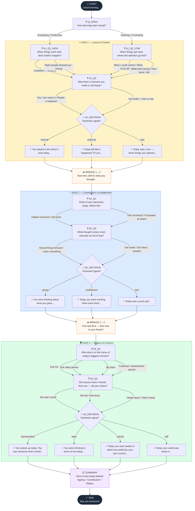

```mermaid
flowchart TD
    START([🌙 START\nGood evening...]) --> Q_OPEN

    Q_OPEN[❓ Q_OPEN\nHow did today feel overall?]
    Q_OPEN -- Energizing / Productive --> A1_Q1_HIGH
    Q_OPEN -- Draining / Frustrating --> A1_Q1_LOW

    %% ─── AXIS 1 ───────────────────────────────────────────
    subgraph AXIS1 ["⚡ AXIS 1 — Locus of Control"]
        A1_Q1_HIGH[❓ A1_Q1_HIGH\nWhen things went well, what made it happen?]
        A1_Q1_LOW[❓ A1_Q1_LOW\nWhen things got hard, where did attention go first?]
        A1_Q2[❓ A1_Q2\nWas there a moment you made a call today?]

        A1_Q1_HIGH -- I prepared / I adapted --> A1_Q2
        A1_Q1_HIGH -- Right people showed up / Timing --> A1_Q2
        A1_Q1_LOW -- What I could control / What I'd do differently --> A1_Q2
        A1_Q1_LOW -- What went wrong / How stuck I felt --> A1_Q2

        A1_Q2 -- Yes I can name it / Maybe it mattered --> A1_DECISION
        A1_Q2 -- Not really / I had no say --> A1_DECISION

        A1_DECISION{🔀 A1_DECISION\nDominant signal?}
        A1_DECISION -- internal --> A1_REFLECT_INTERNAL
        A1_DECISION -- external --> A1_REFLECT_EXTERNAL
        A1_DECISION -- tied --> A1_REFLECT_MIXED

        A1_REFLECT_INTERNAL[💡 You stayed in the driver's seat today...]
        A1_REFLECT_EXTERNAL[💡 Today felt like it happened TO you...]
        A1_REFLECT_MIXED[💡 Today was a mix — some things you steered...]
    end

    BRIDGE_1_2[➡️ BRIDGE 1→2\nNow let's shift to what you brought...]
    A1_REFLECT_INTERNAL --> BRIDGE_1_2
    A1_REFLECT_EXTERNAL --> BRIDGE_1_2
    A1_REFLECT_MIXED --> BRIDGE_1_2

    %% ─── AXIS 2 ───────────────────────────────────────────
    subgraph AXIS2 ["🤝 AXIS 2 — Contribution vs Entitlement"]
        A2_Q1[❓ A2_Q1\nThink of one interaction today. Which fits?]
        A2_Q2[❓ A2_Q2\nWhat thought comes most naturally at end of day?]

        A2_Q1 -- Helped someone / Did extra --> A2_Q2
        A2_Q1 -- Felt unnoticed / Frustrated at others --> A2_Q2

        A2_Q2 -- Moved things forward / Learn something --> A2_DECISION
        A2_Q2 -- Get credit / Get what I needed --> A2_DECISION

        A2_DECISION{🔀 A2_DECISION\nDominant signal?}
        A2_DECISION -- giving --> A2_REFLECT_GIVING
        A2_DECISION -- entitlement --> A2_REFLECT_ENTITLEMENT
        A2_DECISION -- tied --> A2_REFLECT_MIXED

        A2_REFLECT_GIVING[💡 You were thinking about what you gave...]
        A2_REFLECT_ENTITLEMENT[💡 Today you were tracking what came back...]
        A2_REFLECT_MIXED[💡 Today was a push-pull...]
    end

    BRIDGE_1_2 --> A2_Q1
    BRIDGE_2_3[➡️ BRIDGE 2→3\nOne last lens — who was in your frame?]
    A2_REFLECT_GIVING --> BRIDGE_2_3
    A2_REFLECT_ENTITLEMENT --> BRIDGE_2_3
    A2_REFLECT_MIXED --> BRIDGE_2_3

    %% ─── AXIS 3 ───────────────────────────────────────────
    subgraph AXIS3 ["🌍 AXIS 3 — Radius of Concern"]
        A3_Q1[❓ A3_Q1\nWho else is in the frame of today's biggest moment?]
        A3_Q2[❓ A3_Q2\nDid anyone have it harder than you — did you notice?]

        A3_Q1 -- Just me --> A3_Q2
        A3_Q1 -- One other person --> A3_Q2
        A3_Q1 -- My team --> A3_Q2
        A3_Q1 -- Customer / downstream person --> A3_Q2

        A3_Q2 -- Yes and I acted --> A3_DECISION
        A3_Q2 -- Yes but I was busy --> A3_DECISION
        A3_Q2 -- Heads-down / Didn't notice --> A3_DECISION

        A3_DECISION{🔀 A3_DECISION\nDominant signal?}
        A3_DECISION -- transcendent --> A3_REFLECT_TRANSCENDENT
        A3_DECISION -- wide --> A3_REFLECT_WIDE
        A3_DECISION -- narrow --> A3_REFLECT_NARROW
        A3_DECISION -- self --> A3_REFLECT_SELF

        A3_REFLECT_TRANSCENDENT[💡 You looked up today. You saw someone else's world...]
        A3_REFLECT_WIDE[💡 You were thinking in terms of we today...]
        A3_REFLECT_NARROW[💡 Today you were aware of others but pulled by your own current...]
        A3_REFLECT_SELF[💡 Today your world was close-in...]
    end

    BRIDGE_2_3 --> A3_Q1
    SUMMARY[📋 SUMMARY\nHere is how today looked:\nAgency • Contribution • Radius]
    A3_REFLECT_TRANSCENDENT --> SUMMARY
    A3_REFLECT_WIDE --> SUMMARY
    A3_REFLECT_NARROW --> SUMMARY
    A3_REFLECT_SELF --> SUMMARY

    END([✅ END\nSee you tomorrow.])
    SUMMARY --> END

    %% ─── Styles ────────────────────────────────────────────
    style START fill:#1e293b,color:#f8fafc,stroke:#334155
    style END fill:#1e293b,color:#f8fafc,stroke:#334155
    style AXIS1 fill:#fef3c7,stroke:#f59e0b
    style AXIS2 fill:#dbeafe,stroke:#3b82f6
    style AXIS3 fill:#dcfce7,stroke:#22c55e
    style SUMMARY fill:#f3e8ff,stroke:#a855f7
    style BRIDGE_1_2 fill:#fff7ed,stroke:#f97316
    style BRIDGE_2_3 fill:#fff7ed,stroke:#f97316
```
